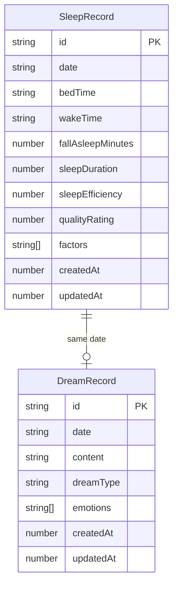

## 1. 架构设计

```mermaid
graph TB
    "Frontend Layer" --> "React + TypeScript + Vite"
    "React + TypeScript + Vite" --> "Router Layer (react-router-dom)"
    "Router Layer (react-router-dom)" --> "Pages"
    "Pages" --> "Components"
    "Components" --> "State Management (Zustand)"
    "State Management (Zustand)" --> "IndexedDB (idb)"
    "Pages" --> "Chart.js"
    "Pages" --> "Canvas 词云"
    "Pages" --> "Web Audio API"
    "Pages" --> "jsPDF"
    "Docker + Nginx" --> "Static Files"
```

纯前端架构，无后端服务。所有数据存储在浏览器IndexedDB中，通过Docker+Nginx提供静态文件服务。

## 2. 技术说明

- **前端框架**：React@18 + TypeScript + Vite
- **初始化工具**：vite-init (react-ts 模板)
- **样式方案**：Tailwind CSS@3
- **状态管理**：Zustand
- **路由**：react-router-dom@6
- **数据存储**：IndexedDB（通过idb库封装）
- **图表库**：Chart.js + react-chartjs-2
- **PDF导出**：jsPDF + html2canvas
- **词云**：基于Canvas自实现
- **音频**：Web Audio API（白噪音混音器）
- **图标**：lucide-react
- **部署**：Docker + Nginx

## 3. 路由定义

| 路由 | 用途 |
|------|------|
| / | 重定向至 /sleep |
| /sleep | 睡眠记录页 |
| /dream | 梦境日记页 |
| /analysis | 关联分析页 |
| /dashboard | 趋势看板页 |
| /tools | 助眠工具页 |
| /timeline | 梦境回溯阅读器 |
| /report | 月度报告页 |

## 4. 数据模型

### 4.1 数据模型定义



### 4.2 IndexedDB 存储结构

**数据库名称**：dreamlog-db
**版本**：1

**对象存储（Object Store）**：

1. **sleepRecords**
   - keyPath: `id`
   - 索引：`date`（唯一）、`createdAt`

2. **dreamRecords**
   - keyPath: `id`
   - 索引：`date`（唯一）、`dreamType`、`createdAt`

### 4.3 数据计算逻辑

- **睡眠时长** = wakeTime - bedTime（跨日计算）
- **睡眠效率** = 睡眠时长 / (睡眠时长 + 入睡耗时) × 100%
- **关联分析**：基于日期关联 sleepRecords 与 dreamRecords，统计各因素下的梦境类型/情绪分布

## 5. 项目目录结构

```
src/
├── components/
│   ├── layout/          # 布局组件（Sidebar, StarField）
│   ├── sleep/           # 睡眠记录相关组件
│   ├── dream/           # 梦境日记相关组件
│   ├── analysis/        # 关联分析组件
│   ├── dashboard/       # 趋势看板组件
│   ├── tools/           # 助眠工具组件
│   ├── timeline/        # 梦境回溯组件
│   └── report/          # 月度报告组件
├── hooks/               # 自定义Hooks
├── pages/               # 页面组件
├── stores/              # Zustand状态管理
├── utils/               # 工具函数（IndexedDB、日期、计算）
├── App.tsx
└── main.tsx
```

## 6. Docker + Nginx 部署方案

- **Dockerfile**：多阶段构建，先构建前端产物，再复制到Nginx镜像
- **nginx.conf**：配置SPA路由回退、gzip压缩、缓存策略
- **docker-compose.yml**：一键启动，映射端口80
